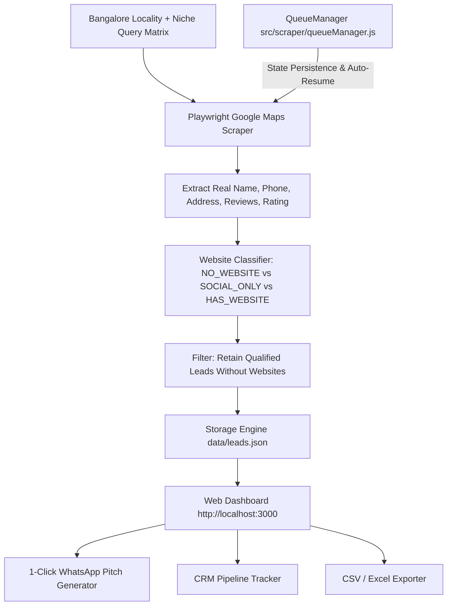

# BLR Leads Engine & Web Agency Platform — Project Context

> **Note for AI Assistants / Developers:**  
> This document provides complete architectural, operational, and strategic context for the Bangalore Business Lead Scraper and Web Outreach Agency project. Read this file at the start of any new session to immediately understand the entire codebase, business logic, and future plans.

---

## 1. Project Mission & Business Model

* **Goal:** Identify high-revenue local businesses in **Bangalore (Bengaluru), India** that maintain strong customer reputations (4.5★+ with dozens or hundreds of Google reviews) but **do NOT have an official custom website** (or only rely on a Justdial / Magicpin / Instagram / Facebook profile).
* **Monetization Model:** Pitch modern, mobile-friendly landing pages and multi-page business websites to these business owners, charging **₹15,000 to ₹60,000+** per website + optional monthly maintenance (AMC).
* **The "Shared Leads Trap" Angle (Top Pitch Hook):**  
  Many Bangalore businesses pay ₹20,000–₹40,000/year to Justdial/IndiaMART, not realizing that when a customer searches on directories, their lead is broadcasted to 5–10 competing businesses at the same second. Pitching them an **official custom website** gives them **100% exclusive customer leads & direct WhatsApp bookings** with zero competitors on their page.
* **Showcase Strategy:** Rather than building separate custom websites in advance, we use **4 Master Dynamic Archetypes** (detailed in [`SHOWCASE_TEMPLATES_STRATEGY.md`](./SHOWCASE_TEMPLATES_STRATEGY.md)) that dynamically inject the lead's business name, locality, review stats, and phone number via URL parameters.

---

## 2. Tech Stack & Architecture

* **Backend:** Node.js (v22+), Express, Playwright (Headless Chromium).
* **Data Storage:** Lightweight, zero-config JSON persistence (`data/leads.json` and `data/scraper_state.json`).
* **Frontend:** Vanilla HTML5, CSS3 (Custom Dark Cyber-Slate Design System), Vanilla JS with Server-Sent Events (SSE) for real-time scraper terminal streaming.
* **Outreach Layer:** One-click WhatsApp deep links (`https://wa.me/91...`), 60-second cold calling scripts, and CSV exports.



---

## 3. Directory & File Map

```
businessScraper/
├── server.js                          # Express server entry point (Port 3000)
├── package.json                       # Dependencies (express, playwright, cors)
├── PROJECT_CONTEXT.md                 # Complete project context (This document)
├── SHOWCASE_TEMPLATES_STRATEGY.md     # Conceptual blueprint for 4 Dynamic Archetype demos
├── data/
│   ├── leads.json                     # Persistent database of verified scraped leads
│   └── scraper_state.json             # QueueManager state for Auto-Resume capability
├── public/
│   ├── index.html                     # Dashboard UI, Live Scraper Console, CRM & Modals
│   ├── style.css                      # Cyber-slate design system with ambient glows
│   └── app.js                         # Frontend controller, filters, SSE streaming & modals
└── src/
    ├── config/
    │   ├── bangaloreAreas.js          # 30+ Bangalore localities categorized by zones (North/South/East/West/Central)
    │   └── businessNiches.js          # 12+ High-ticket niches (Dentists, Interior Designers, Salons, etc.)
    ├── db/
    │   └── storage.js                 # JSON storage CRUD, deduplication, stats calculation & CSV generator
    ├── routes/
    │   └── api.js                     # REST API endpoints & SSE stream (/api/scrape/stream)
    ├── scraper/
    │   ├── mapsScraper.js             # Playwright Google Maps scraper with 2-stage detail extraction
    │   ├── queueManager.js            # Mass Harvester Queue with Pause, Resume & State Recovery
    │   ├── run_real_scrape.js         # CLI test script for quick manual scraping
    │   └── batch_real_scrape.js       # CLI batch script for harvesting multiple areas
    └── services/
        ├── pitchGenerator.js          # WhatsApp, Justdial Hook, Cold Call & Email pitch generator
        └── seedLeads.js               # Reference schema (unwired from live app)
```

---

## 4. Key Components Explained

### A. Google Maps Scraper (`src/scraper/mapsScraper.js`)
* Uses Playwright to navigate `https://www.google.com/maps/search/[query]+in+[locality]+Bangalore?hl=en`.
* Performs 2-stage extraction:
  1. Scans result cards from `div.Nv2PK` feed.
  2. For cards without phone/address visible in snippet, opens the place detail link to extract 100% verified Indian phone numbers (`+91...`), full addresses, and exact review counts.
* **Website Classification:**
  * `NO_WEBSITE` (🔴): No website button exists on Google Maps listing.
  * `SOCIAL_ONLY` (🟡): Website link is only Justdial, Magicpin, Instagram, Facebook, Sulekha, IndiaMART, or Linktree.
  * `HAS_WEBSITE` (🟢): Has custom domain website (automatically filtered out).

### B. Mass Harvester & Auto-Resume Queue (`src/scraper/queueManager.js`)
* Allows queueing all **30+ Bangalore localities $\times$ 12 niches** (360 search combinations).
* Saves queue progress in `data/scraper_state.json`.
* If interrupted or paused, the **Auto-Resume** feature restarts from the exact unfinished target without re-scraping completed ones.
* Includes **Pause ⏸️**, **Resume ▶️**, and **Stop ⏹️** controls.

### C. Pitch & Sales Toolkit Engine (`src/services/pitchGenerator.js`)
* **Standard WhatsApp Pitch:** Praises their Google rating/review volume in their specific locality and offers a 2-minute mobile demo preview link.
* **Justdial / Directory Hook:** Targets businesses listed only on directories, highlighting the shared-lead problem and positioning an official website as exclusive customer acquisition.
* **60-Second Cold Call Script:** 4-stage phone script (Opening, Hook, Problem, Call-to-action).
* **Opportunity Scoring (0–100):** Ranks leads by Review Count + Rating + Missing Website + Phone availability.

### D. Lead CRM & Dashboard (`public/`, `server.js`)
* **Live Scraper Console:** Target specific localities/niches or click "Scrape All Bangalore".
* **Filter Bar:** Filter by website status (No Website vs Social Only), area, niche, and pipeline stage.
* **CRM Pipeline Stages:** `New Lead` ➔ `Contacted` ➔ `Pitch Sent` ➔ `Meeting Booked` ➔ `Closed / Won 🏆` ➔ `Not Interested`.
* **1-Click Outreach:** Opens `wa.me/91...` with tailored pitch ready to send.
* **Export:** One-click CSV export with auto-generated WhatsApp outreach links.

---

## 5. How to Run the Project

### Start the Application:
```bash
cd c:\Users\prith\Desktop\businessScraper
node server.js
```
Open **`http://localhost:3000`** in your browser.

### Run Manual Scrapes via CLI (Optional):
```bash
# Run a quick test scrape
node src/scraper/run_real_scrape.js

# Run a multi-niche batch scrape
node src/scraper/batch_real_scrape.js
```

---

## 6. Next Steps & Future Roadmap

1. **Dynamic Showcase Preview Engine:** Build the 4 dynamic preview templates (Clinical, Portfolio, Beauty, Corporate) that render live demo websites for any lead via `/demo/preview?leadId=...` or query params.
2. **Automated WhatsApp Follow-Up Assistant:** Add tracking for follow-up reminders (e.g. Day 2 follow-up pitch, Day 5 discount hook).
3. **Pincode / Micro-Locality Expansion:** Expand search keywords to sub-localities (e.g. Koramangala 4th Block, 27th Main HSR, 100ft Road Indiranagar).
