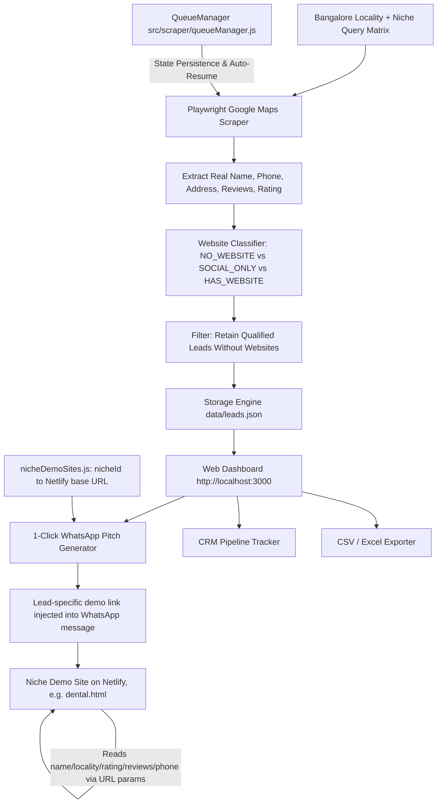

# BLR Leads Engine & Web Agency Platform — Project Context

> **Note for AI Assistants / Developers:**  
> This document provides complete architectural, operational, and strategic context for the Bangalore Business Lead Scraper and Web Outreach Agency project. Read this file at the start of any new session to immediately understand the entire codebase, business logic, and future plans.

---

## 1. Project Mission & Business Model

* **Goal:** Identify high-revenue local businesses in **Bangalore (Bengaluru), India** that maintain strong customer reputations (4.5★+ with dozens or hundreds of Google reviews) but **do NOT have an official custom website** (or only rely on a Justdial / Magicpin / Instagram / Facebook profile).
* **Monetization Model:** Pitch modern, mobile-friendly landing pages and multi-page business websites to these business owners, charging **₹15,000 to ₹60,000+** per website + optional monthly maintenance (AMC).
* **The "Shared Leads Trap" Angle (Top Pitch Hook):**  
  Many Bangalore businesses pay ₹20,000–₹40,000/year to Justdial/IndiaMART, not realizing that when a customer searches on directories, their lead is broadcasted to 5–10 competing businesses at the same second. Pitching them an **official custom website** gives them **100% exclusive customer leads & direct WhatsApp bookings** with zero competitors on their page.
* **Showcase Strategy:** We build one **individually-designed demo site per business niche** (detailed in [`SHOWCASE_TEMPLATES_STRATEGY.md`](./SHOWCASE_TEMPLATES_STRATEGY.md)) — e.g. a dedicated dental site, a dedicated salon site — rather than one generic template shared across niches. Each niche site still dynamically injects any given lead's business name, locality, review stats, and phone number via URL parameters, so one build serves every lead in that niche. Each niche site is deployed separately (Netlify) under its own domain.

---

## 2. Tech Stack & Architecture

* **Backend:** Node.js (v22+), Express, Playwright (Headless Chromium).
* **Data Storage:** Lightweight, zero-config JSON persistence (`data/leads.json` and `data/scraper_state.json`).
* **Frontend:** Vanilla HTML5, CSS3 (Custom Dark Cyber-Slate Design System), Vanilla JS with Server-Sent Events (SSE) for real-time scraper terminal streaming.
* **Outreach Layer:** One-click WhatsApp deep links (`https://wa.me/91...`) carrying each lead's own live demo-site preview URL, 60-second cold calling scripts, and CSV exports.
* **Demo Sites:** Static HTML/CSS/JS per niche (e.g. `public/demo/dental.html`), deployed independently to Netlify. Each lead's real scraped data (name, locality, rating, reviews, phone, address, Maps link) is injected client-side via URL query params — no per-lead build step.



---

## 3. Directory & File Map

```
businessScraper/
├── server.js                          # Express server entry point (Port 3000)
├── package.json                       # Dependencies (express, playwright, cors, dotenv)
├── .env                                # Real env values (gitignored) — DEMO_BASE_URL_<NICHE>, PORT
├── .env.example                       # Template for .env, committed
├── PROJECT_CONTEXT.md                 # Complete project context (This document)
├── SHOWCASE_TEMPLATES_STRATEGY.md     # Per-niche individual demo site strategy
├── data/
│   ├── leads.json                     # Persistent database of verified scraped leads
│   └── scraper_state.json             # QueueManager state for Auto-Resume capability
├── public/
│   ├── index.html                     # Dashboard UI, Live Scraper Console, CRM & Modals
│   ├── style.css                      # Cyber-slate design system with ambient glows
│   ├── app.js                         # Frontend controller, filters, SSE streaming & modals
│   └── demo/                          # One subfolder per niche, each independently deployable
│       └── dental/                    # Dental Clinics demo site (built)
│           ├── index.html
│           ├── style.css
│           └── script.js              # Reads lead data from URL params, binds into DOM
├── websites/                          # Placeholder for finished per-lead/per-niche site exports
└── src/
    ├── config/
    │   ├── bangaloreAreas.js          # 30+ Bangalore localities categorized by zones (North/South/East/West/Central)
    │   ├── businessNiches.js          # 12+ High-ticket niches (Dentists, Interior Designers, Salons, etc.)
    │   └── nicheDemoSites.js          # Maps nicheId -> deployed demo site base URL (env-var driven) + path
    ├── db/
    │   └── storage.js                 # JSON storage CRUD, deduplication, stats calculation & CSV generator
    ├── routes/
    │   └── api.js                     # REST API endpoints, /api/config (incl. demoSites), SSE stream
    ├── scraper/
    │   ├── mapsScraper.js             # Playwright Google Maps scraper with 2-stage detail extraction
    │   ├── queueManager.js            # Mass Harvester Queue with Pause, Resume & State Recovery
    │   ├── run_real_scrape.js         # CLI test script for quick manual scraping
    │   └── batch_real_scrape.js       # CLI batch script for harvesting multiple areas
    └── services/
        ├── pitchGenerator.js          # WhatsApp, Justdial Hook, Cold Call & Email pitch generator; builds each lead's demo URL
        └── seedLeads.js               # Reference schema (unwired from live app)
```

---

## 4. Key Components Explained

### A. Google Maps Scraper (`src/scraper/mapsScraper.js`)
* Uses Playwright to navigate `https://www.google.com/maps/search/[query]+in+[locality]+Bangalore?hl=en`.
* Performs 2-stage extraction:
  1. Scans result cards from `div.Nv2PK` feed.
  2. For cards without phone/address visible in snippet, opens the place detail link to extract 100% verified Indian phone numbers (`+91...`), full addresses, and exact review counts.
* **Website Classification:**
  * `NO_WEBSITE` (🔴): No website button exists on Google Maps listing.
  * `SOCIAL_ONLY` (🟡): Website link is only Justdial, Magicpin, Instagram, Facebook, Sulekha, IndiaMART, or Linktree.
  * `HAS_WEBSITE` (🟢): Has custom domain website (automatically filtered out).

### B. Mass Harvester & Auto-Resume Queue (`src/scraper/queueManager.js`)
* Allows queueing all **30+ Bangalore localities $\times$ 12 niches** (360 search combinations).
* Saves queue progress in `data/scraper_state.json`.
* If interrupted or paused, the **Auto-Resume** feature restarts from the exact unfinished target without re-scraping completed ones.
* Includes **Pause ⏸️**, **Resume ▶️**, and **Stop ⏹️** controls.

### C. Pitch & Sales Toolkit Engine (`src/services/pitchGenerator.js`)
* **Standard WhatsApp Pitch:** Praises their Google rating/review volume in their specific locality and, when that lead's niche has a deployed demo site, drops in that lead's own live preview link (built by `buildDemoUrl()`). If the niche's demo site isn't deployed yet, it falls back to asking "would you like a preview link?" instead of sending a dead URL.
* **Justdial / Directory Hook:** Targets businesses listed only on directories, highlighting the shared-lead problem and positioning an official website as exclusive customer acquisition. Also carries the lead-specific demo link when available.
* **60-Second Cold Call Script:** 4-stage phone script (Opening, Hook, Problem, Call-to-action).
* **Opportunity Scoring (0–100):** Ranks leads by Review Count + Rating + Missing Website + Phone availability.
* **Demo URL Linking (`buildDemoUrl`):** Looks up the lead's `nicheId` in `src/config/nicheDemoSites.js` to get that niche's deployed base URL + path, then appends the lead's name/locality/rating/reviews/phone/address/Google Maps URL as query params — so every pitch always points at the correct, live, business-specific demo.

### D. Lead CRM & Dashboard (`public/`, `server.js`)
* **Live Scraper Console:** Target specific localities/niches or click "Scrape All Bangalore".
* **Filter Bar:** Filter by website status (No Website vs Social Only), area, niche, and pipeline stage.
* **CRM Pipeline Stages:** `New Lead` ➔ `Contacted` ➔ `Pitch Sent` ➔ `Meeting Booked` ➔ `Closed / Won 🏆` ➔ `Not Interested`.
* **1-Click Outreach:** Opens `wa.me/91...` with tailored pitch (incl. the lead's own demo link) ready to send.
* **Preview Buttons:** "🎨 Preview Live Demo" / "🎨 Demo" on each lead card/row link to that lead's live demo site; greyed out with a tooltip if that niche's site isn't deployed yet.
* **Export:** One-click CSV export with auto-generated WhatsApp outreach links.

---

## 5. How to Run the Project

### Start the Application:
```bash
cd c:\Users\prith\Desktop\businessScraper
node server.js
```
Open **`http://localhost:3000`** in your browser.

### Run Manual Scrapes via CLI (Optional):
```bash
# Run a quick test scrape
node src/scraper/run_real_scrape.js

# Run a multi-niche batch scrape
node src/scraper/batch_real_scrape.js
```

---

## 6. Deploying a Niche's Demo Site (Dental Live First)

Each niche's demo site lives in its own subfolder under `public/demo/<niche>/` (e.g. `public/demo/dental/`) as a self-contained `index.html` + `style.css` + `script.js`, with no calls back to this Express app — pure static, deployable as-is. Each folder is deployed to its own Netlify site, independent of this CRM/scraper app. To wire a finished niche site into outreach:

1. Drag that niche's `public/demo/<niche>/` folder onto [app.netlify.com/drop](https://app.netlify.com/drop) (or use `netlify deploy --prod` from inside it). Because the entry file is `index.html`, the demo lands at the site's root — no path config needed per niche.
2. Set its base URL in `.env` (copy `.env.example` to `.env` if you haven't already — it's gitignored, safe for real URLs), e.g. `DEMO_BASE_URL_DENTAL=https://your-site.netlify.app`. Adding a new niche later means adding both a line to `.env`/`.env.example` and an entry in `src/config/nicheDemoSites.js`.
3. Restart `node server.js` (it loads `.env` via `dotenv` on boot — you'll see `injected env (N) from .env` in the startup log). `/api/config` will now return that niche under `demoSites`, the dashboard's preview buttons will activate, and every WhatsApp pitch for that niche's leads will carry that lead's own live link automatically.

Currently only `dental-clinics` has a built demo site (`public/demo/dental/`); `DEMO_BASE_URL_DENTAL` in `.env` is still blank, so dental pitches still use the fallback "would you like a preview?" phrasing until you fill it in and restart.

## 7. Next Steps & Future Roadmap

1. **Deploy the Dental Demo Site:** Push `public/demo/dental/` to Netlify and set `DEMO_BASE_URL_DENTAL` so live dental pitches start carrying real preview links (in progress — outreach to dental leads has started).
2. **Build Remaining Niche Demo Sites:** One individually-designed site per niche (not a shared generic template) — dermatology, interior design, salons/spas, ayurveda, pet clinics, etc. — each added to `nicheDemoSites.js` as it ships.
3. **Automated WhatsApp Follow-Up Assistant:** Add tracking for follow-up reminders (e.g. Day 2 follow-up pitch, Day 5 discount hook).
4. **Pincode / Micro-Locality Expansion:** Expand search keywords to sub-localities (e.g. Koramangala 4th Block, 27th Main HSR, 100ft Road Indiranagar).
